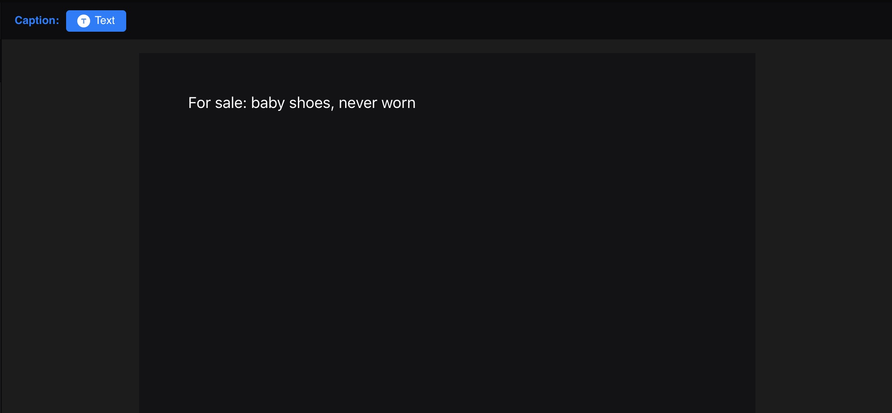
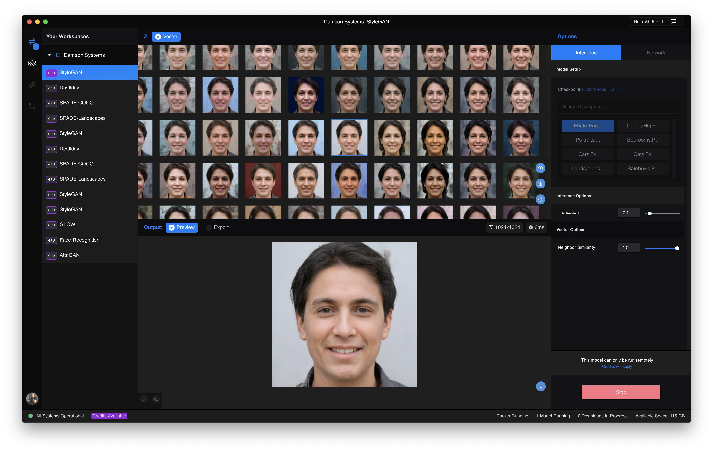

# User Interface Components

One of the main advantages to porting a machine learning model to Runway is that you don't have to spend time designing and building a user interface for users to interact with your model. The Model SDK, in tandem with Runway itself, works to abstract away the details of *how* users get data into and out of a model. As a model porter, you design your model commands, inputs, and outputs using simple [Data Types](data_types.html) which get automatically transformed into UI components inside the app. You don't have to worry about where the data comes from or where it goes once you process it; Runway takes care of that for you.

This abstraction process also unifies the user experience. Once a user learns how to use their camera to process a live video feed, select an input file from disk, or export the output of a model to CSV, they now know how to do these things with all models; They don't have to re-learn the process for each model.

## Workspace View


Users interact with your model by adding it to a workspace. From there they are able to chose input and output sources based on the [Data Types](data_types.html) the model porter specifies in each `@runway.command()` decorator (more on the Runway module [here](runway_module.html)).

The screenshot above depicts an example of [OpenAI's Glow model](https://openai.com/blog/glow/) which manipulates facial features of images containing faces. The Glow model that's been ported to Runway expects an `image` as input accompanied by a facial `feature` category like "Young", "Gray_Hair", or "Smiling" and an `amount` that controls the intensity of the transformation. You will see all three of these inputs listed as "Inference Options" on the right UI control panel. Inference options can be controlled by the user while the model is running (see [Setup Options vs Inference Options](#model-setup-options-vs-inference-options) below).

Each model's Inference Options UI panel is automatically generated based on the code in its `runway_model.py` file. The model porter controls which types of UI components are used for each model using only the `inputs` and `outputs` keyword arguments to each `@runway.command()`. Below is a toy example of what the `runway_model.py` code that generates the UI components looks like for Glow. This code is used for illustrative purposes. Click [here](https://github.com/agermanidis/glow/blob/master/demo/runway_model.py) to see the actual code for the Glow model in Runway.

```python
import runway
from runway import image, category, number
from fake_glow_code import manipulate_image_with_glow

# Facial feature manipulations that can be applied to the input image. Truncated for brevity.
features = '5_o_Clock_Shadow Arched_Eyebrows Attractive Bags_Under_Eyes Bald Bangs'
features = features.split()

manipulate_command_inputs = {
  'image': image(description='The input image containing a face to transform.'),
  'feature': category(choices=features, default=features[2], description='Facial feature to apply.'),
  'amount': number(default=0.5, min=0, max=1, step=0.1, description='The transformation intensity.')
}

manipulate_command_outputs = {
  'output': image(description='The output image containing the transformed face.')
}

manipulate_command_desc = 'Manipulate an image of a face by applying facial feature transformations.'

@runway.command('manipulate',
                inputs=manipulate_command_inputs,
                outputs=manipulate_command_outputs,
                description=manipulate_command_desc)
def manipulate(model, args):
  return {
    'output': manipulate_image_with_glow(args)
  }
```

## Input Sources and Output Destinations

Model porters define the types of input a model receives and the types of output a model produces, but they **do not** define the sources of those inputs or the destinations for those outputs. When a user runs a model that accepts an image as input and produces another image as output **the user** choses where that image comes from before it's sent to the model and where it goes once the model produces a new image as output. This concept applies to all data types, not just images.

### Input Sources

* **Camera**: A webcam or USB camera can be used as an input source for all models that accept an image as input.
* **Text**: A simple text area box for typing or pasting text based input.
* **Vector**: A fixed-width z-vector of floats used as the seed for some generative models like StyleGAN
* **Segmentation**: A drawing tool for creating images composed of objects that represent semantic classes. See SPADE-COCO for an example of this input source.
* **File**: File is unique because it's used to load files from disk in a uniform way across all [Data Types](data_types.html). This input source is used to feed a model input from your filesystem.
* **From Network**: This input source is also unique in that it appears whenever you [interact with a model via the network](https://docs.runwayml.com/#/how-to/network). This input source is available for all models but only appears once model a model has been triggered by a network request.

```eval_rst
.. note::
    Both the **File** and **From Network** input sources are unique in that they aren't made available to users as a result something the model porter defines in a ``@runway.command()`` decorator, but rather they are **always** available to users to load their own data of arbitrary type. **From Network** will only appear once a model has been triggered by a network request.
```

### Output Destinations

* **Preview**: A basic preview window for users to view the output of the model inside of Runway. **Preview** renders output differently depending on the the output type: For instance, it will render an image if a model outputs an image and text if a model outputs text.
* **Export**: Save model output to disk as an exported video, image sequence, or structured text file like CSV or JSON depending on the output data type.

## Model Setup Options vs Inference Options

The data types specified in the `options` keyword argument of `@runway.setup()` and the `inputs` keyword arguments of `@runway.command()` functions are handled somewhat differently by Runway. The former defines options that a user configures **before** the model is started, while the later can be adjusted at any time while the model is running.

```python
import runway
from runway import category, text
from elsewhere import model

setup_options={
  'architecture': category(choices=['Artistic', 'Stable', 'Video'])
}
@runway.setup(options=setup_options)
def setup(opts):
  return model(opts['architecture'])

generate_inputs={
  'render_factor': number(min=1, max=50, default=35)
}

generate_outputs={
  'output': image
}
@runway.command('generate',inputs=generate_inputs, outputs=generate_outputs)
def generate(model, opts):
  return model.generate_image(opts['render_factor'])
```

As a model porter you must decide which of the options that are configurable by the user should be setup options and which should be inference options. A good rule of thumb is that if an option is needed to load or initialize a model it should be a setup option. Otherwise it should be an inference option.


```eval_rst
.. note::
    The same data types and UI components are used in both Model Setup Options and Inference Options. The only difference is that Setup Model options can only be selected before you run the model.
```

## UI Components

Only a limited set of all [Data Types](data_types.html) generate UI components at this time. We are working quickly to render all data types in the app, but we ask for your patience until this task is complete. If you have any questions about data types, UI components, or the Model SDK in general feel free to bring them up in the `#model-sdk` channel in [the public Runway slack](https://runwayml.com/joinslack).

### Support/Compatibility Matrix

\* Denotes this feature is coming soon!

```eval_rst
.. csv-table::
   :header: "Data Type", "Setup Option", "Command Input", "Command Output", "Notes"

   "``image``",        "No", "**Yes**", "**Yes**", "The ``image`` type is also used to process video sequences."
   "``text``",         "No", "**Yes**", "**Yes**", ""
   "``boolean``",      "**Yes**", "**Yes**", "No\*",    "Boolean data types used as input appear on the model options UI on the right side of the workspace view."
   "``category``",     "**Yes**", "**Yes**", "No\*",    "Category data types used as input appear on the model options UI on the right side of the workspace view. If you are looking to output a category, instead output the category value as a string using the ``text`` type for now."
   "``number``",       "**Yes**", "**Yes**", "No",      "Number data types used as input appear on the model options UI on the right side of the workspace view. If you are looking to output a number, instead output a number as a string using the ``text`` type for now."
   "``vector``",       "No", "**Yes**", "No",      "The vector input uses a grid of images. More data types will be supported soon. See StyleGAN for an example."
   "``segmentation``", "No", "**Yes**", "**Yes**",    "Use a regular image as output for now."
   "``file``\^",       "**Yes**", "No", "No",  "^ The file input should not be used as an input or output type for ``@runway.command()``s. Instead the file UI component will be rendered as an optional input source for all types."
   "``array``",        "No", "No\*",      "No\*",  "If you are looking to output an array of strings, join them using a ``, `` and return a ``text`` type for now."
   "``any``",          "No", "No",      "No",      "The any data type is meant to be extensible and used primarily via the Network."
```

### Examples

Each data type is rendered differently in the Runway workspace UI. We'll have a look at what each input data type in detail below.

* [Image](#image)
* [Text](#text)
* [Vector](#vector)
* [Segmentation](#segmentation)
* [Number](#number)
* [Boolean](#boolean)

#### Image

```python
import runway
from runway import image
# this is a fake import for demonstration purposes only
from elsewhere import process_input_image

# The "image" and "output" keys in the input and output dictionaries are arbitrarily named
@runway.command('example', inputs={ 'image': image }, outputs={ 'output': image })
def example(model, args):
  return process_input_image(args['image'])
```

The above code will generate an `image` UI component. The user will then be able to choose either a camera or an image file as the source of the input.


Each input image type also creates an Image Options UI component on the right panel of the workspace view. This panel gives the users the option to resize and manipulate the input image before its sent to the model. The model porter does not have control over these parameters as they are up to the user to chose and will have already been applied to the image by the time it reaches the Model SDK code.


#### Text

```python
import runway
from runway import text

# The "caption" and "informalized" keys in the input and output dictionaries are arbitrarily named
@runway.command('informalize', inputs={ 'caption': text }, outputs={ 'informalized': text })
def informalize(model, args):
  return args['caption'].lower()
```

The above code will generate a `text` UI component. The user will be able to type a string of text into the text box, and that text will be used as the `caption` input to the model.



#### Vector

The code below illustrates how to use the `vector` data type to explore a hyperparameter space by incrementally adding noise to fixed-width z-vector that's used as input to a generative model. This data type is a bit tricky to understand if you don't have much experience with generative models, but have a look at [StyleGAN](https://github.com/agermanidis/stylegan/blob/master/runway_model.py) for an example of its use.

```python
import runway
from runway import vector, image
# this is a fake import for demonstration purposes only
from elsewhere import sample_image_from_z_vector

# The z" and "output" keys in the input and output dictionaries are arbitrarily named
@runway.command('sample', inputs={ 'z': vector }, outputs={ 'output': image })
def sample(model, args):
  return sample_image_from_z_vector(args['z'])
```



#### Segmentation

The segmentation data type is used to define per-pixel labels to an image. Each pixel is annotated with a label id from 0-255, each corresponding to a different object class. Models like NVIDIA's [SPADE](https://nvlabs.github.io/SPADE/) use this data type to generate photorealistic output images using input semantic segmentation map images of only a handful of colors.

```python
import runway
from runway import image, segmentation
# this is a fake import for demonstration purposes only
from elsewhere import generate_image_from_semantic_map

label_to_id = {
    'unlabeled': 0,
    'grass': 124,
    'sky': 156,
    'clouds': 105,
    'sea': 154,
    'river': 148,
    'tree': 169,
    'mountain': 134
}

label_to_color = {
    'unlabeled': (0, 0, 0),
    'grass': (29, 195, 49),
    'sky': (95, 219, 255),
    'clouds': (170, 170, 170),
    'sea': (54, 62, 167),
    'river': (0, 57, 150),
    'tree': (140, 104, 47),
    'mountain': (60, 55, 50)
}

convert_inputs = {
    'semantic_map': segmentation(
      label_to_id=label_to_id,
      label_to_color=label_to_color,
      default_label='unlabeled',
      width=640,
      height=360
    )
}

convert_outputs = {
    'output': image
}

@runway.command('convert', inputs=convert_inputs, outputs=convert_outputs)
def convert(model, args):
    return generate_image_from_semantic_map(args['semantic_map'])
```

Using the `segmentation` data type as input to a command generates a UI component that allows a user to draw directly on a canvas using primitive painting tools and colors that map to the semantic map labels.


#### Number

A number used as input to a model command creates a number slider on the right Model Options UI panel. This data type is often used to pass an adjustable scalar value to a model at runtime, as is illustrated below.

```python
import runway
from runway import number, image
# this is a fake import for demonstration purposes only
from elsewhere import stylize

stylize_inputs = {
  'input_image': image,
  'style_image': image,
  'amount': number(min=0, max=100, default=50)
}

stylize_outputs = {
  'stylized_image': image
}
@runway.command('stylize_image',
                inputs=stylize_inputs,
                outputs=stylize_outputs,
                description='Stylize an image by a certain amount using a style image')
def stylize_image(model, args):
  return stylize(args['input_image'], args['style_image'], args['amount'])
```

Here is an example of the number slider produced by the code above.


#### Boolean

Using the boolean data type as input to a model command generates a simple switch button on the right Model Options UI panel.


```python
import runway
from runway import boolean, text
# this is a fake import for demonstration purposes only
from elsewhere import translate, tokenize

translate_inputs = {
  'english_input': image,
  'tokenize': boolean(default=True),
}

translate_outputs = {
  'french_output': text
}
@runway.command('translate',
                inputs=translate_inputs,
                outputs=translate_outputs,
                description='Translate sentences from English to French')
def translate(model, args):
  english = args['english_input']
  if args['tokenize']:
    english = tokenize(english)
  return translate(english, 'french')
```

Here is an example of the number slider produced by the code above.


